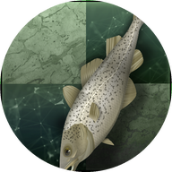
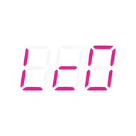
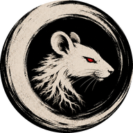
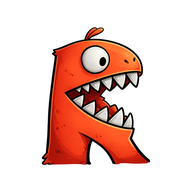
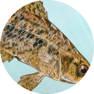
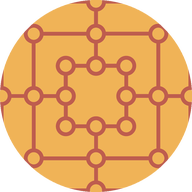

# Games

Offline board games for Android, built with Jetpack Compose. Everything runs on the phone:
no account, no network, the engines are bundled in the APK.

> Personal project, built with AI assistance (Claude Code). No store release is planned: releases are
> published here on GitHub only (installable with [Obtainium](https://github.com/ImranR98/Obtainium)).

Package: `io.github.usernamealreadytakensht.games` · minSdk 29 · ABIs: `arm64-v8a` (phones), `x86_64` (emulator).

## Games

| Game | Status |
|------|--------|
| **Chess** | Playable against the engines below. Two-step setup (colour, clock and options; then opponent). Clocks (sudden death, Fischer, per move), takebacks (unlimited / once / off), move confirmation, auto-queen, engine thinking-time scale, resign, rematch with swapped colours, save/resume, last-move and check highlights, promotion picker. |
| **Draughts** | International 10x10 (FMJD rules: mandatory maximum capture, flying kings) against Scan or Moby Dam. Clocks, undo, resign, rematch, save/resume, multi-capture entry square by square (auto-completed when unambiguous). Rules are a pure-Kotlin engine verified by perft (depth 1–8 from the start position). |
| **Hnefatafl** | Six tafl variants against OpenTafl's AI: **Copenhagen** and **Fetlar** (11x11, corner escapes), **Tawlbwrdd** (11x11, weak king, edge escapes), **Tablut** and **Sea Battle** (9x9, edge escapes), **Brandub** (7x7). Rules and AI both come from OpenTafl, embedded in the app. Same clocks, takebacks, resign, rematch and save/resume as the other games. |
| **Fox games** | **Fox and Hounds** (8x8, 1 fox vs 4 hounds moving forward only; the fox wins by slipping past, the hounds by trapping it — solved, hounds win with perfect play) and **Fox and Geese** (33-point cross board with diagonals, 1 fox vs 13 geese moving any direction; the fox jumps geese in chains, wins under 6 geese; the geese win by cornering it). Against the built-in "Reynard". Same clocks, takebacks, resign, rematch and save/resume. |
| **Nine Men's Morris** | Standard rules (nine men, sliding, flying at three men, mills remove a man outside a mill, draw by threefold repetition or fifty moves without a mill) against the Sanmill engine. Same clocks, takebacks, resign, rematch and save/resume as the other games. |

## Chess opponents

Picked in two steps: an engine, then a version / network, then a strength setting that
depends on how the engine can be limited.

| | Engine | Versions / networks | Strength setting | Range |
|--|--------|--------------------|------------------|-------|
|  | **Stockfish** | 19 (NNUE), 11 (last classical evaluation) | `UCI_Elo` | 1320–3190 (SF 19), 1350–2850 (SF 11), or Max |
|  | **Leela Chess Zero** 0.32.1 | Bad Gyal 8 (128x10), T1 256x10 distilled | Search nodes per move | 1 → 1000 nodes, or time-based |
| | | Maia (1100 → 1900, one network per rating) | Human rating | Elo 1100–1900, no search: plays like a human of that level |
|  | **Maia 3** (5M) | Transformer exported to ONNX, runs in-process | Human rating | Elo 600–2600, no search: one model imitating any level |
|  | **Rodent V** (Go) | Personalities: Rodent, Tal, Tal (hybrid), Ampere, Chaotic, Hector, Nimzoid | `UCI_Elo` | 800–3000, or Max; each personality has its own style, network and opening book |
|  | **Reckless** 0.9 (Rust) | — | Search depth | 1 → 20 plies, or time-based |
| | **PlentyChess** 8.0 (C++) | — | Search depth | 1 → 20 plies, or time-based |
| | **Berserk** 14 (C) | — | Search depth | 1 → 20 plies, or time-based |
|  | **Sunfish** 2026 | Kotlin port, runs in-process | Search depth | 1 → 20 plies, or time-based |

Rough feel: the Maia models are the only opponents that play *like a human* (Maia 3 covers 600–2600, the Lc0 Maia networks 1100–1900). Stockfish's Elo
mode is adjustable but artificial (perfect moves with random errors). The depth-limited
engines stay solid even at depth 1 (~1600+) because their evaluation is strong; they simply
stop seeing tactics. Sunfish is the genuinely weak one.

Engines run as separate processes over UCI (`lib*.so` files executed from the app's native
library directory); Sunfish is Kotlin code. Only one engine process lives at a time.

## Draughts opponents

Both speak the Hub protocol (Scan's `protocol.txt`); neither has a rating limiter, so
strength is a search depth (1 → 20) or time-based Max.

| Engine | Notes |
|--------|-------|
| **Scan** 3.1 (C++) | Fabien Letouzey's computer-olympiad champion. Ships with its opening book and evaluation weights (~11 MB), no endgame bitbases. Book randomness on for variety. |
| **Moby Dam** (C) | Harm Jetten's engine, a notch below Scan. Evaluation tables and book (~1.5 MB). Launched with a 16 MiB transposition table (`-t 20`). |

Rough feel: depth 1–3 drops material to simple shots, depth 6 is a solid club game, depth
12+ is far beyond human level.

## Nine Men's Morris opponent

Rules are pure Kotlin (`game/morris/Morris.kt`), verified by unit tests (geometry, mill and
removal rules, flying, game ends, notation). Strength is a search depth (1 → 16) or
time-based Max.

| | Engine | Notes |
|--|--------|-------|
|  | **Sanmill** (Rust) | The engine of the [Sanmill](https://github.com/calcitem/Sanmill) app (`tgf uci`), run as a process over its UCI dialect. Three of its search algorithms are exposed: **MTD(f)** (its default), **Alpha-beta**, and **MCTS** (Monte-Carlo, where the strength setting scales the simulations instead of the depth). The perfect-play database is not shipped. |

Rough feel: depth 1–3 misses simple mills, 5–6 is a solid opponent, 10+ is very hard to beat.

## Hnefatafl variants and opponent

| Variant | Board | Escape | Notes |
|---------|-------|--------|-------|
| **Copenhagen** | 11x11 | Corners | The modern tournament standard: strong king, shieldwall captures, edge forts. |
| **Fetlar** | 11x11 | Corners | The Fetlar Hnefatafl Panel rules: same forces, no shieldwall or edge forts. |
| **Tawlbwrdd** | 11x11 | Edges | Welsh: the king is weak (two attackers take him) and any edge square wins. |
| **Tablut** | 9x9 | Edges | Linnaeus' Sámi game: armed king, strong only on the throne. Shorter games. |
| **Sea Battle** | 9x9 | Edges | The king takes no part in captures at all. |
| **Brandub** | 7x7 | Corners | The Irish game, 8 vs 4 and a king: a couple of minutes per game. |

All six come from OpenTafl's own rule sets (`rules/…`), so the app only picks one and draws
the board at its size.

[OpenTafl](https://github.com/jslater89/OpenTafl) is written in Java, so it is not
cross-compiled: `opentafl/build.sh` copies its engine core (rules, notation, AI — about
18 k lines) into `opentafl/java/`, which the app compiles as an extra source set with a few
stubs (`opentafl/stubs/`) in place of the desktop terminal-UI classes it references. Its
`GameState` referees the game and `AiWorkspace` (iterative-deepening alpha-beta with
transposition, killer and history tables) is the opponent for every variant; strength is a
maximum depth (1 → 10) or time-based Max. Depth 1–2 overlooks captures, 4 plays a fair game,
6+ is strong. Unit tests check each variant's start position and board size, sliding moves,
corner restrictions, a custodial capture, notation and an engine move.

## Fox games opponent

No third-party engine: rules (`game/fox/Fox.kt`, both variants behind `FoxVariant`) and the
opponent (`engine/fox/FoxEngine.kt`, iterative-deepening negamax with a transposition table)
are pure Kotlin. The games are small enough that depth 8+ is close to perfect play; strength
is the depth (1 → 20) or time-based Max. Unit tests cover the geometry of both boards, hound
direction, fox jump chains, game ends, notation and the engine's tactics.

## Building

The Android project builds with Android Studio as usual, **but the engine binaries and
networks are not committed** (they weigh ~280 MB per ABI). Generate them once with the
scripts below (Git Bash on Windows; they use the NDK from the Android SDK):

```
./stockfish/build.sh      # Stockfish 19 + 11
./lc0/build.sh            # Lc0 + Bad Gyal, T1 and Maia networks
./reckless/build.sh       # needs rustup (installed by the script's instructions)
./plentychess/build.sh    # needs a running x86_64 emulator (network pre-processing)
./berserk/build.sh
./rodent/build.sh         # needs Go (a plain unzip of the official SDK is enough)
./sanmill/build.sh        # morris: Sanmill's Rust engine (rustup; see the script for the Windows quirks)
./opentafl/build.sh       # hnefatafl: copies OpenTafl's Java core into opentafl/java (no toolchain needed)
./scan/build.sh           # draughts: Scan + its book/eval data
./mobydam/build.sh        # draughts: Moby Dam + eval tables/book
```

Maia 3 is exported from the PyTorch checkpoint with `maia3/export_onnx.py` (needs a Python venv
with torch, onnx, onnxruntime, python-chess and the `maia3` package); the script also writes
`maia3/reference.json`, which the unit tests use to check the Kotlin encoder against Python.

Each script explains its own quirks (cross-files, thread stack sizes, network layouts).
The build produces one APK per ABI (`app-x86_64-debug.apk` for the emulator,
`app-arm64-v8a-debug.apk` for a phone).

## Credits and licenses

See [THIRD_PARTY.md](THIRD_PARTY.md) for the full table. In short:

- Engines: [Stockfish](https://github.com/official-stockfish/Stockfish),
  [Leela Chess Zero](https://github.com/LeelaChessZero/lc0),
  [PlentyChess](https://github.com/Yoshie2000/PlentyChess),
  [Berserk](https://github.com/jhonnold/berserk),
  [Sunfish](https://github.com/thomasahle/sunfish),
  [Rodent V](https://github.com/nescitus/Rodent-V),
  [Scan](https://github.com/rhalbersma/scan), [Moby Dam](https://github.com/rhalbersma/mobydam) — GPL-3.0;
  [Reckless](https://github.com/codedeliveryservice/Reckless),
  [Sanmill](https://github.com/calcitem/Sanmill) — AGPL-3.0;
  [OpenTafl](https://github.com/jslater89/OpenTafl) — Free-As-In-Beer license (modified: the
  desktop UI classes its engine core references are replaced by stubs, see `opentafl/`).
- Networks: [Maia](https://github.com/CSSLab/maia-chess) (GPL-3.0),
  [Maia 3](https://github.com/CSSLab/maia3) (AGPL-3.0),
  [Bad Gyal](https://github.com/dkappe/leela-chess-weights), T1 256x10 (lczero.org).
  The Maia authors ask that their papers be cited:
  [Aligning Superhuman AI with Human Behavior](https://arxiv.org/abs/2006.01855) (KDD 2020) and
  [Chessformer](https://arxiv.org/abs/2605.19091) (ICLR 2026).
- Logos: Stockfish icon by Klein Maetschke, Lc0 logo from lczero.org, Maia icon from the
  Maia platform, Reckless, Sunfish, Rodent V and Sanmill logos from their repositories. PlentyChess has
  no logo and Berserk's README art is from the manga (not ours to redistribute), so those two
  get original glyphs drawn for this app (a cornucopia and a double-bit axe), as do the
  draughts engines Scan (radar sweep) and Moby Dam (sperm whale).
- Pieces: Cburnett chess set (GFDL / CC BY-SA 3.0), Antonsusi draughts stones (public domain),
  both from Wikimedia Commons — see [art/pieces/README.md](art/pieces/README.md). The hnefatafl
  and fox-game pieces and board icons are drawn for this app.
- Rules: [chesslib](https://github.com/bhlangonijr/chesslib) (Apache-2.0).

This app itself is distributed under the GPL-3.0 (see [LICENSE](LICENSE)), as required by the engines it bundles.
